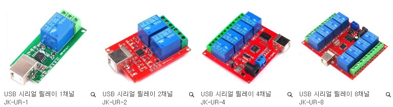
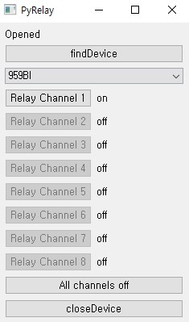

# PyRelay
'pyrelay.py' is the python code to control USB Relay Module.
## Compatible Devices
* JK-UR-1
* JK-UR-2
* JK-UR-4
* JK-UR-8

http://deviceshop.net/product/list.html?cate_no=140&page=1
## Test App for Window
